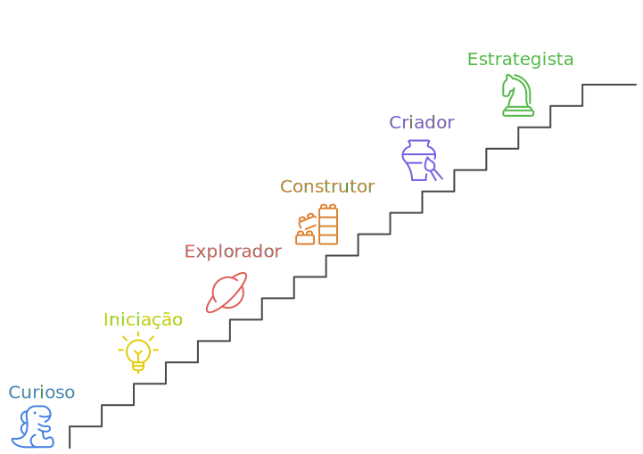

import { Highlight }  from '@site/src/components/highlightv2'

Parabéns por iniciar sua jornada no <Highlight>GPT Estratégico</Highlight>: *domine o uso estratégico do ChatGPT no ambiente corporativo*! O simples fato de estar aqui já demonstra sua curiosidade e disposição para explorar o fascinante mundo da inteligência artificial. Este é o primeiro passo para <Highlight>transformar a maneira como você pensa e trabalha com o ChatGPT</Highlight>.  

Meu objetivo neste guia é oferecer um conteúdo claro, prático e direto ao ponto — sem abrir mão dos aspectos técnicos essenciais — para que você aproveite ao máximo o potencial do ChatGPT, com segurança e confiança. <Highlight>Mais do que prompts. Estratégia. Eficiência. Crescimento.</Highlight>

Estruturei este material para que cada capítulo represente uma conquista, marcada por um *badge* que simboliza seu progresso e as habilidades adquiridas ao longo do caminho.

A proposta é oferecer uma experiência prática, que começa pelo básico e evolui até o uso realmente estratégico da ferramenta. Estarei com você em cada etapa dessa jornada de descobertas.

Se você prefere ter uma visão geral do que vai aprender, siga comigo e confira a apresentação de cada capítulo a seguir. 👇 Caso contrário, pode ir direto ao Capítulo Curioso [clicando aqui](curioso/curioso-abertura).

## **0. Curioso**
Todo começo merece ser celebrado, e o Capítulo Curioso é o ponto de partida da sua jornada. Aqui, você é incentivado a dar o primeiro passo prático: criar sua conta no ChatGPT. Ao final, você conquista o Badge Curioso, reconhecendo sua iniciativa e curiosidade em desbravar o mundo do ChatGPT!

## **1. Iniciação**  
Neste primeiro passo, você descobrirá os conceitos fundamentais que sustentam o ChatGPT: o que é, como funciona e por que prompts são essenciais para maximizar o seu uso. Você será guiado por práticas simples e exemplos para explorar a ferramenta sem medo, entendendo seus limites e possibilidades. Ao final, você conquista o *Badge Iniciante* – a prova de que está pronto para se aprofundar nesta jornada!

## **2. Explorador**  
Agora é hora de aprimorar sua habilidade de criar prompts precisos e eficazes. Este capítulo apresenta dicas e estratégias que vão transformar a forma como você faz perguntas, usando clareza, especificidade e contexto como aliados. Com exercícios práticos e exemplos aplicáveis, você passará de simples interações para diálogos inteligentes e relevantes. Ao terminar, o *Badge Explorador* será seu, celebrando seu progresso!

## **3. Construtor**  
Aqui, você aprenderá a usar o ChatGPT de maneira interativa e estratégica. Descubra como formular perguntas que promovam conversas dinâmicas e como explorar diferentes respostas para obter mais profundidade. Este é o momento de ir além do óbvio, adotando uma postura crítica e criativa. Ao dominar essas técnicas, você ganha o *Badge Construtor*, marcando seu domínio na construção de interações enriquecedoras.

## **4. Criador**  
Neste capítulo, mergulhamos nos bastidores do ChatGPT, explorando como ele funciona e os desafios que enfrenta, como vieses e alucinações. Você aprenderá a criar prompts que combinam criatividade com técnica, além de verificar informações e evitar armadilhas comuns. Saia deste capítulo com o *Badge Criador* e uma habilidade refinada para usar a IA de forma estratégica e consciente.

## **5. Estrategista**  
Está na hora de elevar seu jogo. Descubra estratégias avançadas para criar resumos eficientes, formular prompts complexos e validar informações externas. Este capítulo mostra como usar templates e outras ferramentas para economizar tempo e garantir consistência nos resultados. Ao final, o *Badge Estrategista* será a recompensa por sua habilidade em otimizar o uso do ChatGPT.