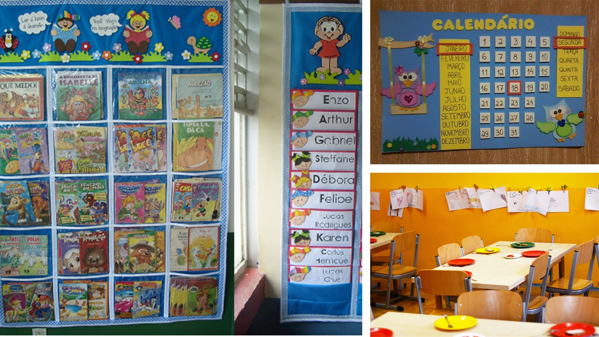
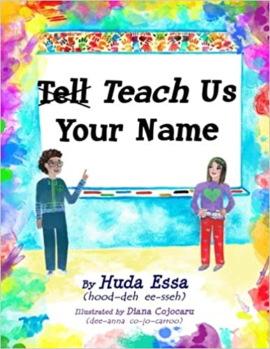
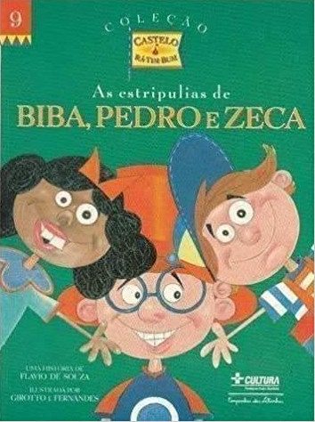

 

Abaixo apresentamos uma lista de atividade que podem ser feitas tendo como base o nome próprio. O objetivo não é detalhar cada proposta, mas trazer ideias que podem inspirar o seu processo de criação e planejamento de aulas.

## Chamada invertida
Esta atividade foi inspirada no livro **~~Diga~~ Nos ensine o seu nome** escrito por Huda Essa e, claro, a minha experiência na primeira chamada do ano letivo... 🤔 

A proposta é que a professora, no lugar de chamar os alunos pelo nome para conhecê-los no primeiro dia do ano, inverta o processo e peça para que os alunos se apresentem falando o seu nome. No caso de nomes qua não são comuns na comunicade, que o próprio aluno ensine a todos como pronunciá-lo.

## História do nome
Atividade bastante difundida que pede aos alunos conversarem com seus pais sobre a origem e motivação dos seus respectivos nomes.
Depois disso, em uma roda de conversa, os alunos compartilham as origens e histórias dos seus nomes.

## Que nome eu escolheria?
Esta atividade tem como base uma proposta presente no material [Pró Letramento - Alfabetização e Linguagem - fascículo 1](http://portal.mec.gov.br/seb/arquivos/pdf/Proletr/fasciculo_port.pdf) (p. 28). Nele é apresentado o relato da professora Cleusa que, depois de trabalhar o poema [Nome da gente](textosmusicas), muitos alunos questionaram sobre a escolha do nome. Isso levou a professora a uma nova leitura com os alunos:

:::note As estripulias de Biba, Pedro e Zeca
*Por que a gente não pode escolher o próprio nome?
Quando uma criança nasce, os pais têm que registrar essa criança no cartório,
para ela existir como cidadã, como moradora oficial da cidade, do país, do
mundo. A certidão de nascimento é o primeiro documento que a gente tem. E
os pais têm que pôr o nome e o sobrenome da criança na certidão de
nascimento, e não adianta perguntar para um bebê que nome ele quer ter,
adianta?*

<small>
Flávio de Souza. As estripulias de Biba, Pedro e Zeca. São Paulo: Companhia das
Letras, 1997. p. 9.
</small>

:::

Pergunta aos alunos... **Se pudessem falar logo ao nascer, que nome escolheriam?** Claro, temos também um gancho aqui com a proposta de leitura da [certidão de nascimento dos alunos](#certidão-de-nascimento).

## Certidão de nascimento
Esta atividade tem o objetivo de conhecer documentos de identificação como **Certidão de Nascimento** e **RG** (identidade).
O ideal é que os alunos possam trazer uma cópia da sua Certidão de Nascimento. O professor pode trabalhar também com uma cópia da seu próprio RG.

Oportunidade de localizar o nome da criança e dos familiares. Assim como leitura da hora e do local de nascimento.

## Chamada e ajudante do dia
Uso do cartão com o nome dos alunos (crachá ou *tag*) para realização da chamada. Identificação do respectivo cartão durante a chamada. Escrita do nome dos alunos faltantes. Escrita no quadro ou calendário o nome de quem será o ajudante do dia. Esta escrita pode ser feita, por exemplo, pela professora (ajuda de toda a turma) ou por uma dupla de alunos.

Assista trecho do vídeo da NOVA ESCOLA com a proposta da [*chamada*](https://youtu.be/MfiEJ_Y22Bc?t=119).

Algumas professoras também sugerem usar música ou cantar parlendas conhecidas pelas crianças. O nome *cantado* pela professora deverá ser encontrado entre os cartões com os nomes dos alunos.

## Nome em todo lugar
Nome dos alunos na tabela de nomes da turma, em seus pertences, espaço para a mochila e etc.

## Música "fundo do mar"
Com os cartões do nome no centro da roda a professora canta e indica o nome do aluno que vai ser *tirado do fundo do mar*.

## Aniversariante do dia
Escrita ou identificação do(s) aniversariante(s) do dia no quadro ou no calendário. 
* Escrita coletiva no quadro simulando um cartão de aniversário.
* Professora fornece o cartão de aniversário e passa para que os alunos coloquem o seu nome.

Assista trecho do vídeo da NOVA ESCOLA com a proposta do [*cartão de aniversário*](https://youtu.be/MfiEJ_Y22Bc?t=464) .

## Adivinha - De quem é o nome?
A professora escolhe um dos cartões de nome disponíveis na *chamada* e brinca de *adivinhação* com os alunos. Revela aos poucos cada letra do nome e conversando sobre as hipóteses de nome e escrita.

Assista trecho do vídeo da NOVA ESCOLA com a proposta [*de quem é o nome?*](https://youtu.be/MfiEJ_Y22Bc?t=698).

## Bingo
Atividade bastante difundida em que a professora sorteia letras e os alunos encontram a letra no seu nome. A professora pode não só reforçar o *nome* da letra mas, antes de anunciar qual letra foi sorteada, fazer conexões com os nomes dos alunos que tenham a respectiva letra.

Assista trecho do vídeo da NOVA ESCOLA com a proposta do [*bingo*](https://youtu.be/MfiEJ_Y22Bc?t=982).

## Jogo da memória
Jogo da memória envolvendo o nome e a foto de cada aluno.

## Cartinha pra quem?
O professor brinca que é o carteiro, sorteia um cartão com nome de aluno, e pergunta para quem ele deve entregar a carta.

## Agrupamento de nomes
A professora organiza os alunos em grupos e os convida a separar conjuntos de nomes que compartilhem as mesmas letras (início, final, etc.). A professora passa pelos grupos e pergunta quais nomes foram agrupados e o que motivou o agrupamento.

## Atravessando o rio
Uma releitura do jogo da forca. A professora sorteia um nome e, para cada letra deste, coloca um círculo no quadro. Os círculos identificam espaços para colocar as pedras - letras - que permitem atravessar o rio. Os alunos precisam descobrir qual o nome sorteado.
