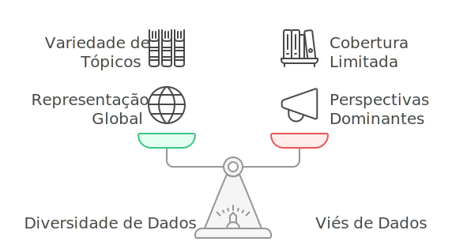

import useBaseUrl from '@docusaurus/useBaseUrl';

# O viés
Já escrevi neste guia que o ChatGPT foi treinado com uma vasta quantidade de textos da internet, incluindo livros, artigos, notícias, sites e fóruns. Durante esse processo, ele "aprendeu" analisando bilhões de exemplos de como as pessoas se comunicam. Esses exemplos foram criados por pessoas de diferentes partes do mundo, o que é positivo, pois oferece uma diversidade de informações. Porém, é aqui que surge um desafio.

Nem todos os grupos de pessoas têm a mesma presença online. Certos países, culturas, grupos sociais e áreas profissionais produzem muito mais conteúdo que outros. Como resultado, os textos usados para treinar o ChatGPT refletem a visão dos grupos que estão mais representados na internet.

Na *web*, algumas opiniões e crenças se tornam populares ou amplamente aceitas, seja por tradições culturais, normas sociais ou simplesmente por serem as mais difundidas. Essas opiniões acabam aparecendo com frequência nos dados que treinaram o modelo. Assim, o ChatGPT pode trazer essas visões como se fossem universais ou "verdadeiras", mesmo que sejam apenas o reflexo das vozes mais dominantes.

Isso não significa que o ChatGPT tenha uma "opinião" própria ou que esteja intencionalmente sendo parcial. Ele apenas reflete o que foi mais frequente nos dados disponíveis. Portanto, se a maioria dos textos segue uma linha de pensamento predominante, o modelo tende a reproduzir essas ideias, o que chamamos de viés em um modelo de IA.

Além disso, nem todos os assuntos foram abordados com a mesma profundidade ou frequência nos dados de treinamento. Para alguns tópicos, o ChatGPT teve acesso a muitas informações e perspectivas variadas, enquanto para outros, os dados foram mais limitados. Isso faz com que, em certos casos, ele possa não oferecer respostas tão completas ou diversificadas.

O ChatGPT passa por esforços contínuos para minimizar o viés. Isso inclui a curadoria dos dados de treinamento, o uso de técnicas avançadas de ajuste e a revisão constante do desempenho do modelo. Esses esforços visam tornar as respostas mais justas e equilibradas, mas é importante lembrar que nenhum modelo de IA é completamente isento de viés.

:::danger[Uso Consciente]
O ChatGPT é uma ferramenta poderosa, mas não substitui a pesquisa crítica. Use as respostas como ponto de partida e complemente seu conhecimento com fontes acadêmicas, notícias confiáveis e outras ferramentas de pesquisa.
:::

Em resumo, o ChatGPT é uma poderosa ferramenta de processamento de linguagem natural, mas suas respostas são limitadas pelos dados com os quais foi treinado. Embora ele ofereça uma vasta gama de informações, é essencial reconhecer que ele reflete as vozes mais predominantes da internet. Isso pode introduzir algum viés em suas respostas. Portanto, use o ChatGPT com senso crítico e sempre confronte suas respostas com outras fontes, buscando diferentes perspectivas.