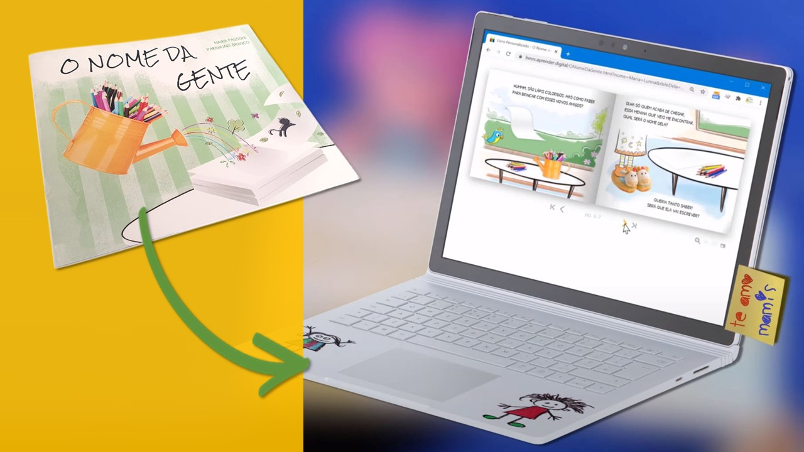
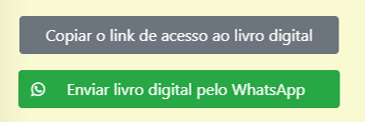
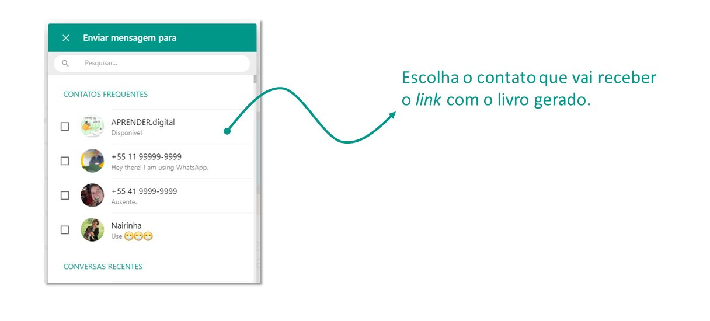

import LivroONDG from '../src/js/LivroONDG';

 

## Link para acesso
A versão digital do livro você encontra no endereço [livros.aprender.digital](https://livros.aprender.digital/).

## Como gerar
O livro digital é gerado de acordo com os dados preenchidos no formulário:
1. Primeiro preencha o campo **Nome** com o nome do seu aluno ou da criança que vai receber o livro. Digite um nome com **até 15 letras**. Sugerimos usar o nome sem o sobrenome. Por exemplo: Julia, Ana Cláudia, Felipe.
1. **Clique sobre a frase** que define a pessoa que vai receber o livro: gênero feminino ou masculino.
3. Pressione o botão **GERAR LIVRO**.

Colocamos uma janela aqui embaixo para que você possa gerar o livro aqui dentro do *Guia*. 👇 
<LivroONDG />

## Navegação do livro
Na imagem abaixo 👇 apresentamos a funcionalidade dos botões disponíveis no livro digital.

 

## Como compartilhar o livro
Navegue até a página **13** do livro. Lá você encontrará dois botões:

* Copiar o link de acesso ao livro digital.
* Enviar livro digital pelo WhatsApp.

### WhatsApp
A opção **WhatsApp** já diz tudo. Ao pressionar o botão, 
o link que dá acesso ao livro gerado será aberto automaticamente no aplicativo WhatsApp.
O comportamento será diferente a depender do seu dispositivo.
Caso esteja acessando o livro em seu celular, o aplicativo WhatsApp será iniciado.
Caso esteja usando o navegador Internet o WhatsApp vai apresentar as opções de enviar via aplicativo (caso você tenha ele instalado)
ou via WhatsApp web.

### Copiar o link
Esta opção serve para você **copiar** o link de acesso ao livro digital. 
Uma vez copiado, você pode **colar** este link no aplicativo que desejar como o Gmail, Outlook, Facebook ou Telegram por exemplo.
