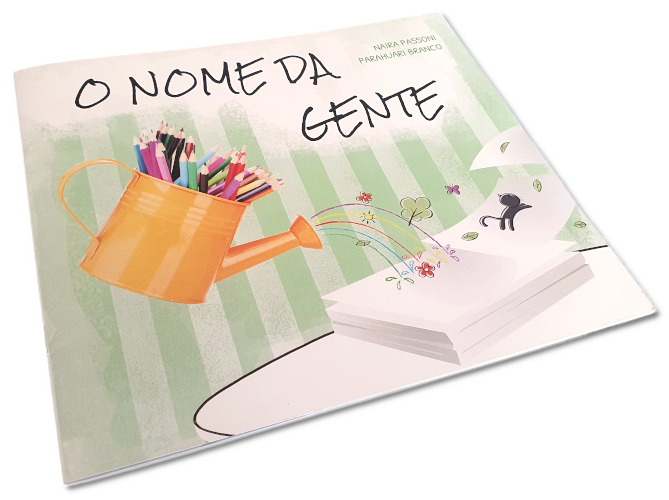
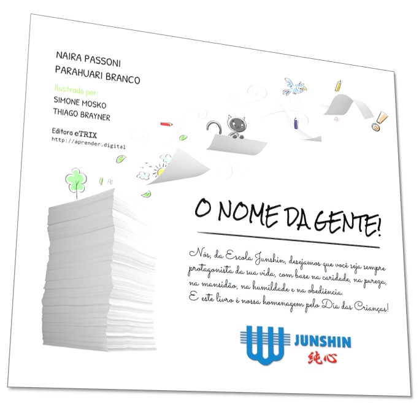
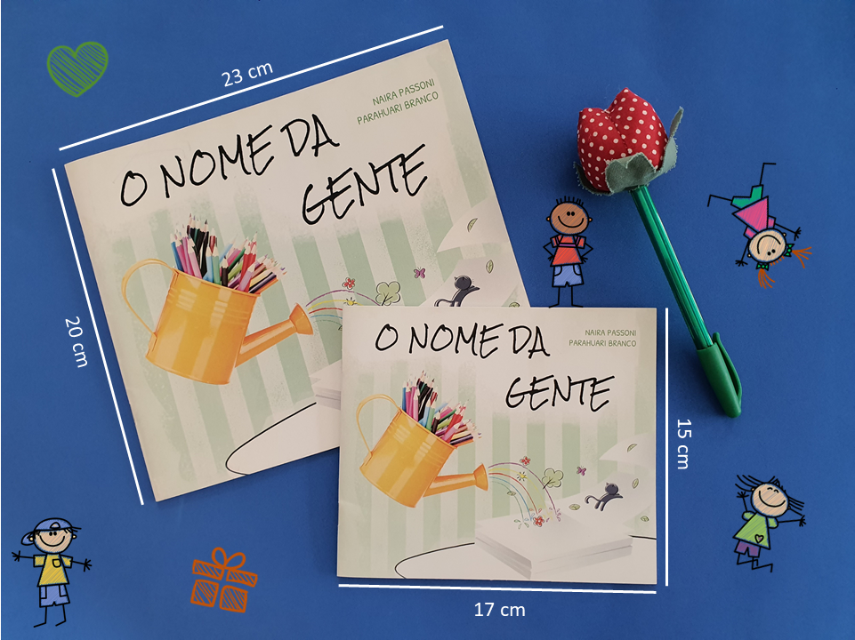

A versão impressa do livro é produzida em formato canoa com 23cm de largura por 20cm de altura. A impressão é digital, colorida e conta com 12 páginas.

Este livro deve ser adquirido diretamente [com a editora eTrix](https://aprender.digital/index.html#mu-pricing).

Veja abaixo os recursos exclusivos da versão impressa.
## Dedicatória
Para tornar o livro ainda mais especial, a dedicatória da folha de rosto é personalizada com o seu próprio texto.

## Tamanhos
Exclusivamente para as escolas, oferecemos duas opções de tamanho: 
* **Padrão**: 23cm de largura por 20cm de altura.
* **Reduzida**: 15cm de largura por 17cm de altura.

