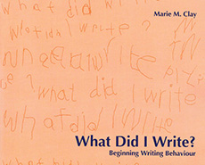

import ReactPlayer from 'react-player/youtube'

## O nome próprio
A utilização do nome próprio como instrumento de alfabetização tem se consolidado como uma prática significativa e eficaz no processo de aprendizagem da escrita. Embora pareça uma proposta recente, seu uso pedagógico remonta a décadas passadas, sendo documentado em diferentes contextos educacionais ao longo do tempo.

## Referências Históricas e Pesquisas Iniciais
Em 1936, **Hildreth**, em seu artigo *Sequências de desenvolvimento na escrita de nomes*, já observava a relevância do nome próprio no desenvolvimento da escrita espontânea. Ao analisar produções de crianças entre três e seis anos, o autor identificou que muitas delas demonstravam interesse em escrever seus nomes nos desenhos. A partir dessas observações, Hildreth concluiu que a escrita do nome próprio poderia ser considerada um indicativo importante do desenvolvimento infantil, mesmo sem instrução formal.

:::note Hildreth
*Quando descobrimos, ao fazer exames mentais abrangentes de crianças entre três e seis anos de idade, 
que muitas das crianças pareciam **ansiosas para escrever seus nomes** em seus desenhos, 
tornamos o exercício de escrita de nomes uma parte rotineira de todos os exames dessas crianças. 
Este experimento preliminar, mas informal,
deu evidências convincentes de que a habilidade da criança de escrever seu nome melhorou constantemente dos três aos seis anos de idade, 
sem qualquer instrução direta na escrita, e que maturidade excepcional ou imaturidade na escrita de nomes, 
além da instrução direta, foi um fator significativo **sinal de desenvolvimento**. 
A fim de verificar esta hipótese provisória, 
dados sobre a escrita de nomes foram coletados de crianças nessas faixas de idade de maneira mais uniforme e sistemática.*
:::

Décadas depois, em 1975, **Marie Clay**, com sua obra *O que eu escrevi?*, reforçou a ideia de que as crianças pequenas escrevem com intenção e propósito, mesmo quando ainda não dominam o sistema alfabético. Ela observou que, para muitas crianças, o nome próprio é a primeira palavra que conseguem identificar e tentar reproduzir, servindo como âncora no processo de apropriação da linguagem escrita.

:::note Clay
*O nome próprio tem sido visto como um passo inicial para o desenvolvimento das habilidades de escrita.*
:::

## A Contribuição de Emília Ferreiro
A partir da década de 1980, com a publicação em português da obra *Psicogênese da Língua Escrita*, de Emília Ferreiro e Ana Teberoski, iniciou-se no Brasil a discussão de uma nova perspectiva sobre o processo de alfabetização. Essa abordagem rompeu com a concepção tradicional de ensino mecânico e passou a enfatizar a ideia de que a criança constrói ativamente hipóteses sobre o funcionamento do sistema de escrita, com base em suas experiências e interações com o mundo letrado.

No texto *Os processos construtivos de apropriação da escrita* (1982), Ferreiro discute como a escrita do nome próprio ocupa um lugar especial nesse processo. Para ela, o nome próprio é simultaneamente uma fonte de informação e de conflito cognitivo: ao tentar compreender por que determinadas letras aparecem sempre em seu nome ou por que a grafia pessoal pode coincidir com outras palavras escritas, a criança entra em contato com a lógica do sistema alfabético.

Ainda que os mecanismos de construção do nome próprio sejam semelhantes aos de outras palavras, seu valor simbólico e afetivo o torna único: trata-se de uma palavra com forte vínculo identitário. Segundo Ferreiro, é justamente essa característica que permite ao nome próprio funcionar como uma "peça-chave" na transição entre a escrita pré-silábica e formas mais avançadas de representação escrita.

:::note Ferreiro
*Insistimos: o nome próprio é **fonte de informação** e **fonte de conflito**. 
A criança não entende por que o número de letras não está relacionado à idade; 
ele não entende por que sua caligrafia - que é sua - pode aparecer em outros escritos; 
será capaz de dar uma interpretação estável
a essa totalidade sem compreender a relação que as partes têm com o todo, etc. 
Em suma, os processos de construção do nome próprio são em todos os sentidos **semelhantes** 
aos processos de construção de **outros nomes**, exceto - e nisso reside **toda a diferença** - 
que as letras não são de qualquer tipo.*

*Nesse sentido, a escrita do nome próprio nos parece constituir uma **peça-chave** para compreender a 
passagem da correspondência de um tipo lógico (uma letra, mas qualquer, para cada sílaba) 
à correspondência estabilizada própria da escrita.*

<small>
*Emilia Ferreiro, Margarita Gómez Palacio. 
Nuevas perspectivas sobre los procesos de lectura y escritura. p. 152.*
</small>
:::

## Políticas Públicas e Formação Docente
Influenciado pelos estudos de Ferreiro e Teberoski, o Ministério da Educação (MEC) lançou, em 2000, o **Programa de Formação de Professores Alfabetizadores** (Profa). Com o objetivo de qualificar a prática docente e promover uma alfabetização significativa, o **Profa** propôs uma abordagem baseada na concepção construtivista de aprendizagem, com ênfase no uso do nome próprio como estratégia pedagógica. Um dos módulos do programa — "O próprio nome e os nomes próprios" — abordava diretamente essa proposta, oferecendo recursos e reflexões para a prática docente.

### Vídeo - Parte 1

<ReactPlayer url='https://www.youtube.com/watch?v=w5LFEvEtqTQ' controls={true} width='100%' light = {true} />

### Vídeo - Parte 2

<ReactPlayer url='https://www.youtube.com/watch?v=1DfFR0Tr0Uk' controls={true} width='100%' light = {true} />

## BNCC e o Nome Próprio na Alfabetização
A Base Nacional Comum Curricular (BNCC) também reconhece a importância da valorização da linguagem escrita em contextos significativos desde a Educação Infantil. A BNCC propõe que crianças tenham contato com a escrita em práticas sociais reais e destaca, entre os direitos de aprendizagem, o “direito de expressar-se” e o de “explorar linguagens”. Nesse contexto, o trabalho com o nome próprio se alinha plenamente com os princípios da BNCC, pois permite à criança reconhecer-se como sujeito no processo de aprendizagem e experimentar a escrita de forma concreta, funcional e afetiva.

## A Prática Docente e o Reconhecimento de Experiências
A Revista Nova Escola, em 2014, publicou um especial intitulado *O nome próprio na alfabetização*, reforçando a relevância dessa prática. A publicação trouxe relatos de experiências de professoras, como Alaide, da EMEI Dr. José Augusto (São Paulo), que mostraram como o nome próprio pode ser ponto de partida para múltiplas aprendizagens — reconhecimento do sistema alfabético, noções de espacialidade na escrita, diferenciação de letras, e fortalecimento da identidade.

<ReactPlayer url='https://www.youtube.com/watch?v=MfiEJ_Y22Bc' controls={true} width='100%' light = {true} />

 

O especial da Nova Escola foi organizado em três tópicos:
* [Por que alfabetizar com nome próprio](https://novaescola.org.br/arquivo/nome-proprio/por-que.shtml)?
* [Oito atividades para fazer com a turma](https://novaescola.org.br/arquivo/nome-proprio/atividades.shtml).
* [Como atender às demandas reais de aprendizagem](https://novaescola.org.br/arquivo/nome-proprio/intervencoes.shtml).

No material, a especialista Diana Grunfeld respondeu, em vídeo, a dúvidas comuns de educadores, como a idade ideal para iniciar esse trabalho, o uso de letras bastão e a viabilidade da prática na Educação de Jovens e Adultos (EJA), reforçando que o nome próprio é uma ferramenta pedagógica potente em diferentes contextos e faixas etárias.

1. Existe idade ideal para iniciar o trabalho com o nome próprio? 👉[**vídeo**](https://youtu.be/M-Mg4xkG-0k?t=11)
1. Letras bastão são as mais adequadas para o início da alfabetização? 👉[**video**](https://youtu.be/M-Mg4xkG-0k?t=61)
1. É possível trabalhar com o nome prório na EJA? 👉[**vídeo**](https://youtu.be/M-Mg4xkG-0k?t=129)

## Considerações Finais
O uso do nome próprio na alfabetização é mais do que uma estratégia didática: é uma prática que reconhece o sujeito em sua singularidade e favorece a construção do conhecimento a partir de experiências significativas. Ao permitir que a criança se veja representada na escrita, esse recurso desperta interesse, promove reflexões e contribui para uma aprendizagem mais ativa, crítica e autoral.

