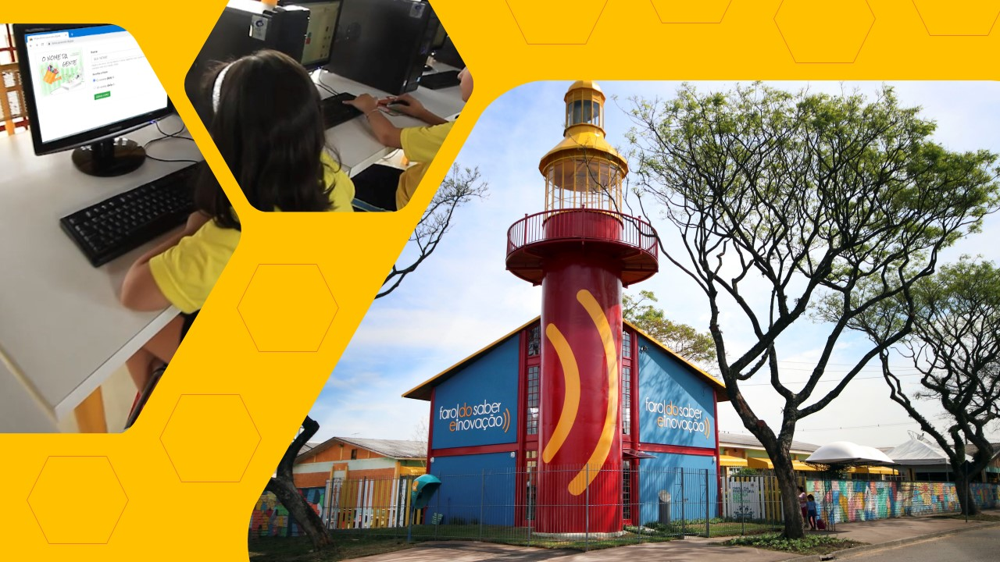
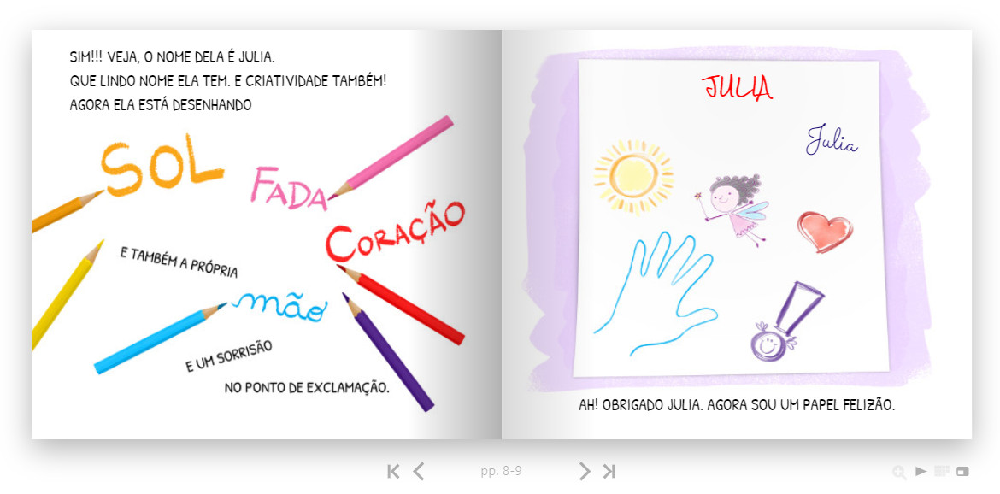
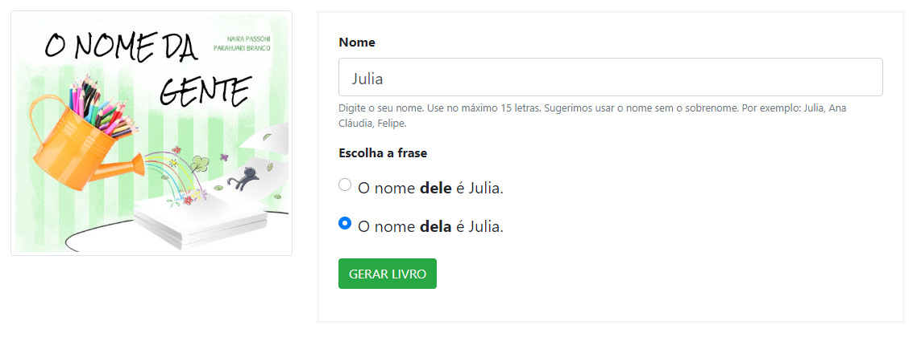
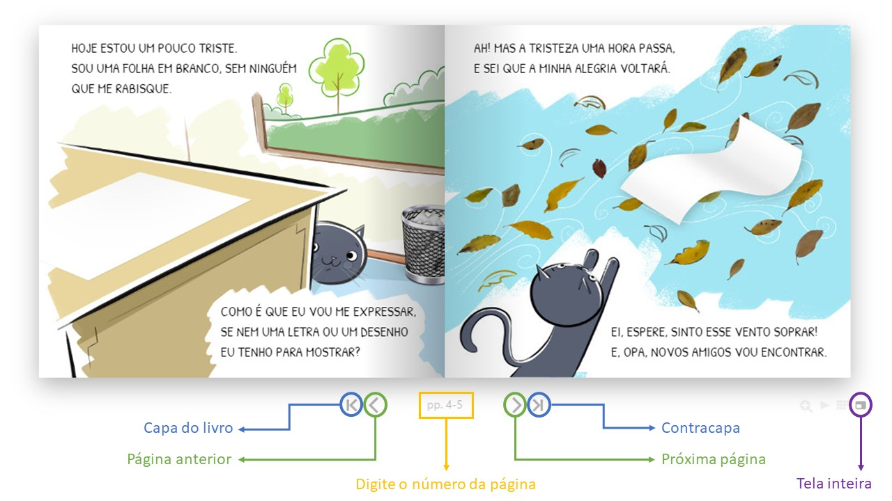

import ReactPlayer from 'react-player/youtube'

## Finalidade
Familiarizar a criança com o sistema de escrita e incentivar o gosto pela leitura.
* Contação de história do livro O NOME DA GENTE impresso.
* Personalização da versão DIGITAL do livro.

## Ano
Crianças do 1.° ou 2.° anos do Ensino Fundamental.

## Objetivo
Identificar e escrever o próprio nome utilizando recurso tecnológico - computadores ou tablets - e localizar o nome próprio no livro digital.

## Habilidades da BNCC
* (EF15LP03) Localizar informações explícitas em textos.
* (EF15LP16) Ler e compreender, em colaboração com os colegas e com a ajuda do professor e,
mais tarde, de maneira autônoma, textos narrativos de maior porte como contos (populares, de
fadas, acumulativos, de assombração etc.) e crônicas.
* (EF01LP01) Reconhecer que textos são lidos e
escritos da esquerda para a direita e de cima
para baixo da página.
* (EF12LP01) Ler palavras novas com precisão na decodificação, no caso de palavras de uso
frequente, ler globalmente, por memorização.
* (EF01LP04) Distinguir as letras do alfabeto de
outros sinais gráficos.
* (EF01LP11) Conhecer, diferenciar e relacionar
letras em formato imprensa e cursiva,
maiúsculas e minúsculas.
* (EF01LP12) Reconhecer a separação das
palavras, na escrita, por espaços em branco.
* (EF02LP07) Escrever palavras, frases, textos
curtos nas formas imprensa e cursiva.
* (EF01LP14) Identificar outros sinais no texto
além das letras, como pontos finais, de
interrogação e exclamação e seus efeitos na
entonação.

## Área
Linguagens.

## Eixo
* Leitura.
* Análise linguística.

## Materiais necessários
* Exemplar impresso do livro O NOME DA GENTE (ou projetor para a versão digital);
* Computadores ou tablets para uso dos estudantes;
* Folhas A4 e lápis coloridos que atendam o número de crianças;
* Internet para acesso ao livro O NOME DA GENTE digital [livros.aprender.digital](https://livros.aprender.digital/);
* (opcional) [Folha impressa](./assets/pagina-ajuda.pdf) para ajudar a orientar sobre o uso da interface do livro digital. 

## Preparação para a aula
* Criar uma história/contexto para o nome usado na personalização do seu livro O NOME DA GENTE - neste roteiro estamos usando como exemplo a Luana;
* Folhas A4 deverão estar guardadas ou “escondidas” para que possam ser facilmente alcançadas ao final da contação da histório do livro O NOME DA GENTE.

## Conhecimentos Prévios
Para a realização desta aula consideramos importante que os alunos já possuam noções básicas sobre a utilização do teclado, mouse ou tablet.

## Tempo Sugerido
1 aula.

## Exemplo
Veja este roteiro em ação com a participação da autora Naira Passoni na 2ª Parada Literária Curitibana.

<ReactPlayer url='https://www.youtube.com/watch?v=r0OQ4U7O2Nc' controls={true} width='100%' />

## Roteiro

### Início da atividade
* Receba e acomode as crianças.
* Abra a atividade explicando que hoje eles não só conhecerão como também participarão da história do livro O NOME DA GENTE.
* Apresente rapidamente os autores e comente que na história existem dois personagens: a pequena **LUANA**:warning: (de 6 anos) e um personagem surpresa. Este personagem será conhecido assim que a história começar!

:::caution Luana

Neste roteiro estamos usando o nome **Luana**, mas você deve usar o nome que estiver no seu livro. A história descrita abaixo é uma sugestão. Você pode usá-la apenas trocando a LUANA pelo nome presente no seu livro, ou mesmo criar e contar a sua própria história. 😎 O importante é que, assim como a história da nossa Luana, a sua personagem também crie um contexto que conecte com a história presente no livro O NOME DA GENTE.

:::

### História da Luana
 > — Antes de iniciar a nossa leitura de hoje, eu quero contar para vocês uma ouuuutra história que inspirou esse livro aqui, O nome da gente!  
 > — É a história de uma menininha chamada Luana. 
 > — A Luana sempre gostou de rabiscar as coisas. Desde bem pequenininha, ela rabiscava tudo que via pela frente, até mesmo as paredes e o sofá, o que a mãe dela não gostava muito! Aliás, todo mundo aqui sabe que não devemos riscar as paredes e sofá? Certo?! 
 > — Acontece que, um dia, a Luana aprendeu a escrever o nome dela, a desenhar muitas coisas legais e também aprendeu que o lugar certo para escrever é no papel! 
 > — Desse dia em diante, ela passou a escrever o nome dela e fazer seus desenhos em todas as folhas em branco que via pela frente. Sabem por que? 
 > — Porque a Luana achava que o papel em branco se sentia muito triste e sozinho quando não tinha nada escrito ou desenhado nele, e isso fazia a Luana ficar triste também. 
 > — Para se alegrar e também deixar o papel feliz, ela sempre dava um jeito de escrever seu nome e de fazer os seus desenhos. Tanto que o quarto da Luana sempre foi cheio de papéis desenhados e os cadernos dela nunca ficaram em branco! 
 > — Assim, surgiu essa história que agora eu vou contar para vocês! 😍 Preparados? Então vamos lá: 

### Leitura do livro O Nome da Gente
* A atividade continua com a contação da história presente no livro O NOME DA GENTE.
* Durante a história, apresente as ilustrações de cada página do livro. Isso vai ajudar as crianças quando elas estiverem navegando pelo livro digital no computador.
* Atente para as palavras que as crianças podem não conhecer como expressar, tanto e ponto de exclamação.
* Ao final do livro, converse um pouco com as crianças sobre a história. Você pode fazer perguntas como:
 * O que elas gostaram da história?
 * Quais são as personagens?
 * Por que o papel estava triste?
 * O que a Luana fez para o Papel ficar “felizão”?

### Papéis tristes 😢
* Após a conversa com os alunos, é hora de uma “encenação”. Você pode falar algo como:
> — Mas o que é isso que estou ouvindo? Vocês também estão ouvindo?  
> Neste momento, você vai até aonde ficaram “escondidas” as folhas de papel A4. Prossegue o diálogo.  
> — Olhem só, isso! Temos vários papéis tristinhos aqui! 
> — Mas, vejam, também temos lápis coloridos! 
> — Que tal deixarmos esses papéis felizes, hein?! 
* Distribua as folhas e disponibilize os lápis coloridos.
* Peça para que cada um escreva o seu nome e faça um desenho para deixar o Papel “feliz”.
* A atividade de desenho deve ocupar de 5 a 10 minutos.
* Caso alguma criança tenha dificuldade em escrever o seu próprio nome, você (ou algum adulto que estiver com ela) pode ajudar. O nome dela escrito vai ser importante para a próxima etapa da personalização do livro no computador.

### Papéis felizes 😊
* Agora que os papéis estão todos muito felizes 😊 vamos para a última etapa da atividade. Esta etapa consiste em cada uma das crianças gerar no computador a história do NOME DA GENTE personalizada com o seu nome.
* Você pode convidar as crianças para o computador da seguinte forma:
> — Parabéns a todos vocês! Estou vendo que não tem mais nenhum papel tristinho por aqui!!! 
> — Lembram que eu falei que vocês iriam não só conhecer, mas também participar de O NOME DA GENTE? 
> — Se você já escreveu o seu nome e fez um desenho para deixar o seu papel bem “felizão”, igual a menina do livro, você agora também faz parte desta história. 
> — Quem já terminou vai me ajudar a manter a sala organizada colocando os lápis de cores no lugar. 
> — Agora que está tudo arrumadinho, podem pegar, cada um a sua folha, e vamos até os computadores. 

### Personalizando o livro digital
* Dependendo da quantidade de crianças/computadores poderá ser necessário a ajuda de uma ou mais pessoas durante esta etapa.
* As crianças podem utilizar os computadores de forma individual ou em duplas. Pais, responsáveis, monitores ou professores presentes podem ajudar as crianças no processo de geração, leitura e busca do nome no livro digital.
* Você pode ter uma [folha impressa com as duas imagens abaixo (uma na frente outra no verso)](./assets/pagina-ajuda.pdf) para ajudar na orientação do processo de geração e navegação no livro.
* Estimule as crianças à leitura da história, seja por meio dos textos e/ou imagens.
* Pergunte quem agora é o personagem que ajuda o papel?
* Pergunte a elas quantas vezes o nome próprio aparece no livro.
* Ajude as duplas que não conseguirem identificar todas as ocorrências do seu nome na história.
* Mostre aos alunos a diferença na grafia do nome, explorando o tipo de letra, que pode ser cursiva ou em caixa alta, por exemplo, como aparece no livro. 
* A medida que as crianças concluem o trabalho com o livro digital, agradeça a participação e, caso necessário, navegue para a página inicial do gerador de livros e disponibilize o computador para uma próxima dupla.

### Como funciona o livro digital
* O processo de personalização do livro O NOME DA GENTE se encontra no endereço [livros.aprender.digital](https://livros.aprender.digital).
* Na página inicial do gerador de livros, primeiramente deve ser preenchido o nome da criança. Depois da digitação do nome deverá ser escolhido o gênero. A opção **o nome dele** gerará a história para o gênero masculino e opção **o nome dela** para o gênero feminino. Veja a imagem abaixo: 

* Depois de escrito o nome na caixa de texto, oriente-os a clicarem no botão verde para **gerar o livro**.
* Para navegar (trocar de página) clique (ou arraste) no canto inferior de cada página ou utilize as setas à **esquerda** e à **direita**.

* Para gerar um novo livro, navegue até a última página e pressione o botão **Personalizar livro digital para outra criança**.