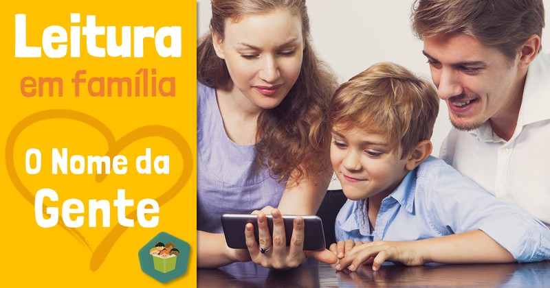

 

## Finalidade
O objetivo desta atividade é proporcionar às famílias uma leitura compartilhada da versão digital do livro **O NOME DA GENTE** como um meio de incentivar o hábito de ler e colaborar no processo de alfabetização da criança.

* Familiarizar a criança com o sistema de escrita.
* Trabalhar a sua identidade.
* Incentivar o gosto pela leitura.
* Fortalecer os vínculos familiares por meio da leitura compartilhada.

## Ano
 * Nível V &#8212; Pré-escola (BNCC)
 * EF &#8212; 1o ano

## Objetivo
Reconhecer o próprio nome utilizando recurso tecnológico &#8212; computador, tablet ou celular &#8212; e localizar o nome próprio no livro digital.

## Habilidades da BNCC
 * (EI03EF03) Escolher e folhear livros, procurando orientar-se por temas e ilustrações e tentando identificar palavras conhecidas.
 * (EI03EO04) Comunicar suas ideias e sentimentos a pessoas e grupos diversos. 
 * (EI03EF04) Recontar histórias ouvidas e planejar coletivamente roteiros de vídeos e de encenações, definindo os contextos, os personagens, a estrutura da história.

## Área
Linguagens

## Eixo
Leitura

## Ação
 * Envio de atividade para os pais dos alunos da Educação Infantil e séries iniciais, voltada à alfabetização e estímulo à leitura.
 * Personalização do livro infantil O NOME DA GENTE.

## Preparação 
* Acessar a página [https://criatividade.digital/blog/dnli/meu-nome-minha-identidade/](https://criatividade.digital/blog/dnli/meu-nome-minha-identidade/) para a leitura do texto MEU NOME, MINHA IDENTIDADE.
* Conhecer o formulário de personalização do livro, que vem logo após o texto.
 * Selecionar a lista de emails dos pais da sua turma.

## Como fazer
Depois de ler o texto [MEU NOME, MINHA IDENTIDADE](https://criatividade.digital/blog/dnli/meu-nome-minha-identidade/) e experimentar o funcionamento do formulário disponível ao final da página, você estará pronto para iniciar a atividade.

A proposta é simples: os pais ou responsáveis irão gerar um livro digital personalizado para seus filhos e realizar uma leitura compartilhada em casa. O próprio texto *Meu nome, minha identidade* já apresenta o contexto da atividade e oferece o formulário para criação do livro, o que facilita bastante o processo.

Sendo assim, sua principal tarefa será enviar um e-mail aos responsáveis explicando que a ideia é realizar uma leitura em família com o livro gerado.

**Dicas para o envio do e-mail:**
- Se for enviar para várias famílias, lembre-se de usar o campo Cco (Cópia Oculta) para proteger a privacidade dos e-mails.
- Como sugestão de assunto do e-mail, você pode usar: *Atividade especial: leitura compartilhada do livro "O NOME DA GENTE"*


Se quiser, copie ou tome como base o exemplo de texto abaixo para a mensagem do seu e-mail:


```
Olá, famílias! Tudo bem?

Gostaria de compartilhar com vocês uma proposta especial que une leitura, afeto e o processo de alfabetização das crianças.

O nome próprio é um elemento muito significativo na vida escolar dos pequenos. Ele ajuda na construção da identidade, na familiarização com as letras e palavras, e se torna uma excelente porta de entrada para o mundo da leitura e da escrita.

Pensando nisso, convidamos vocês para uma atividade de leitura em família com o livro digital O NOME DA GENTE, uma história personalizada com o nome do seu filho ou filha. A proposta é simples e afetuosa: gerar o livro com o nome da criança e realizar a leitura juntos em casa, fortalecendo os vínculos familiares e estimulando a aprendizagem de forma lúdica.

Como participar:
Acesse o texto MEU NOME, MINHA IDENTIDADE (https://criatividade.digital/blog/dnli/meu-nome-minha-identidade/), que apresenta o contexto da proposta.

Ao final do texto, você encontrará um formulário para gerar o livro digital personalizado.

Preencha com o nome da criança e pronto! O livro estará disponível para ser lido em família.

É uma atividade simples, significativa e cheia de carinho — e esperamos que ela renda bons momentos juntos!

Um abraço,
[Seu nome]

```
