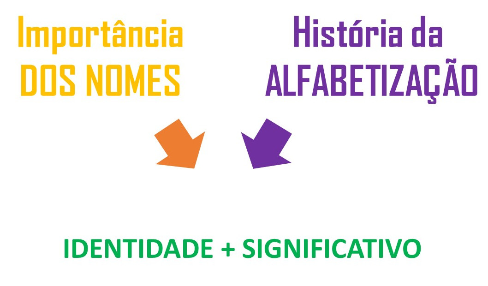

import ReactPlayer from 'react-player/youtube'

Antes mesmo de compreender como as letras se organizam para formar palavras, a criança já reconhece algo muito especial: o seu próprio nome. Ele carrega identidade, afeto e significado — e é justamente por isso que pode ser um ponto de partida tão poderoso no processo de alfabetização. Paralelamente, entender como a alfabetização foi historicamente construída no Brasil nos permite refletir com mais clareza sobre os caminhos pedagógicos que trilhamos atualmente. A imagem a seguir apresenta essas duas dimensões: a relevância dos nomes próprios na aprendizagem e a trajetória da alfabetização, convidando-nos a pensar em práticas mais humanas, contextualizadas e significativas.

O uso do nome próprio na alfabetização parte do princípio de que se trata de uma palavra significativa e familiar para a criança, funcionando como ponto inicial para a reflexão sobre o sistema de escrita. Essa abordagem valoriza a participação ativa da criança com a linguagem escrita, permitindo que ela observe e manipule letras, sons e estruturas a partir de algo que possui valor pessoal. O nome próprio facilita o reconhecimento das letras, a percepção de semelhanças e diferenças entre palavras, além de contribuir para o desenvolvimento da consciência fonológica e ortográfica.

No vídeo a seguir, exploramos a importância dos nomes e como eles contribuem para a construção da identidade.

<ReactPlayer url='https://www.youtube.com/watch?v=iXEWsdZfnd0' controls={true} width='100%' />

 
Quando o nome da criança é valorizado, ela se sente vista, reconhecida e motivada a aprender. Essa simples escolha pedagógica pode transformar o cotidiano da sala de aula e fortalecer o vínculo entre afetividade e aprendizagem.

Para entender melhor como chegamos a práticas como essa — que colocam a criança no centro do processo —, vale a pena olhar para o caminho que a alfabetização percorreu ao longo do tempo no Brasil.
Você já parou para pensar em como os métodos de alfabetização evoluíram ao longo dos anos?

No próximo vídeo, fazemos uma viagem pela história da alfabetização, desde as primeiras cartilhas do século XIX até a atual Base Nacional Comum Curricular (BNCC). A produção apresenta como diferentes abordagens — sintéticas, analíticas, mistas e construtivistas — foram sendo adotadas ao longo dos anos, sempre em busca de formas mais eficazes e significativas de ensinar crianças a ler e escrever.

<ReactPlayer url='https://www.youtube.com/watch?v=npLIBgJeQS8' controls={true} width='100%' />

 
É interessante perceber como a alfabetização no Brasil foi — e continua sendo — marcada por transformações, debates e aprendizados.

Compreender esse percurso histórico nos permite reconhecer que os métodos não são neutros: eles expressam concepções sobre infância, linguagem, ensino e aprendizagem. Mais do que escolher um único caminho, o essencial é construir práticas que valorizem o significado, o contexto e o engajamento das crianças com a linguagem desde os primeiros anos.