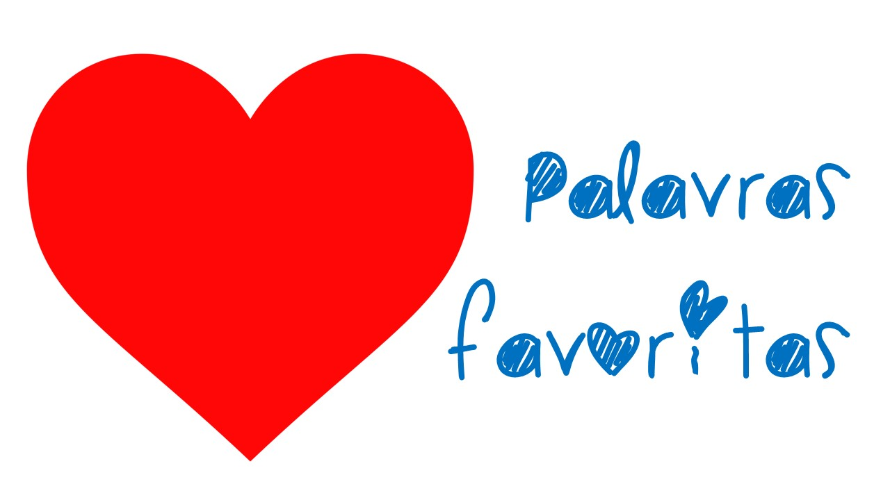

 

Uma forma de complementar ou expandir o trabalho com o nome próprio é a inclusão de atividades envolvendo **listas**.

A proposta é realizar atividades similares as feitas com o nome próprio, mas usando um novo conjuto de palavras.
Não estamos falando de um conjunto de palavras quaisquer.
A proposta é criar a lista de palavras com a ajuda dos alunos.

Por exemplo, você pode criar com os alunos listas de palavras *favoritas* com as temáticas:
* Brinquedos.
* Comidas.
* Personagens (histórias em quadrinho, super-heróis, seriados de tv e etc.).
* Bichos.

Podem ser outras listas também, como a dos nomes dos **animais de estimação**, por exemplo.
O importante é que a lista seja de palavras que as crianças **conheçam** e **gostem**.

