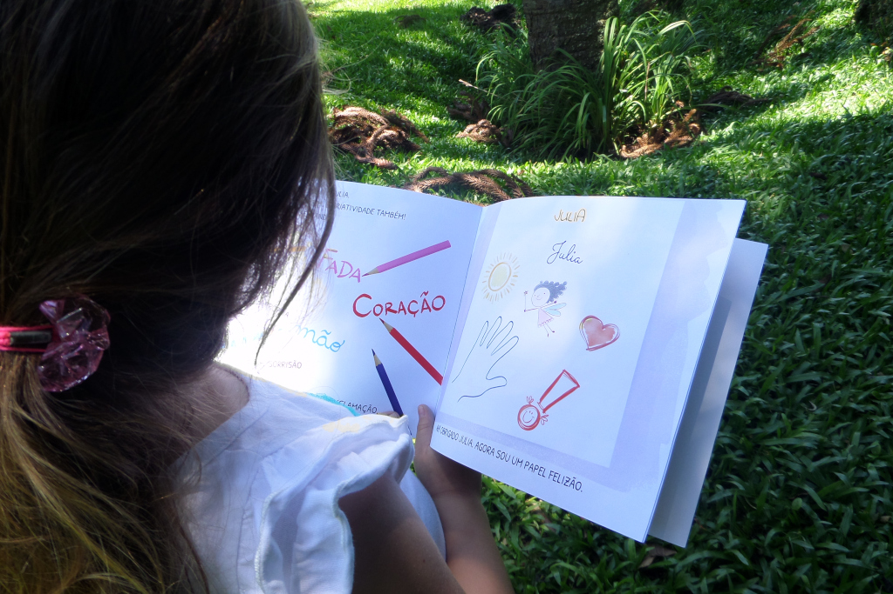
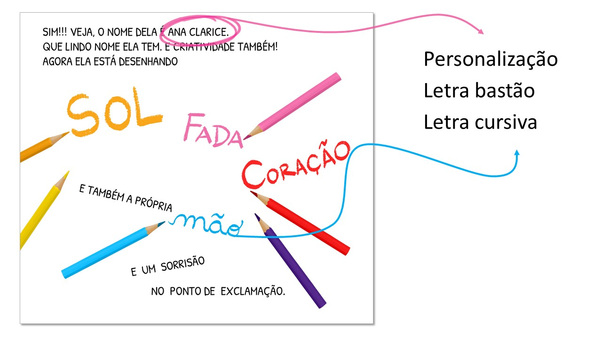
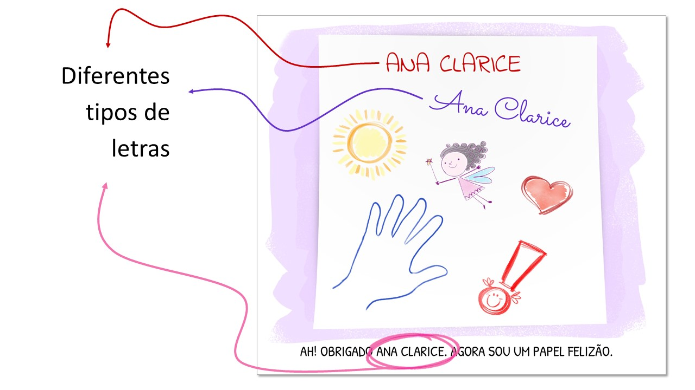

## Sobre o livro
**O NOME DA GENTE** é um livro exclusivo e personalizável que incentiva a criança a reconhecer o seu nome escrito, as letras, os sons, a similaridade com outras palavras e propõe a participação não só da escola, mas também da família, por meio da leitura, de forma prazerosa, no processo de alfabetização.

 

## Proposta
Nossa proposta parte da ideia de que o **nome próprio** é um importante elemento no processo da alfabetização infantil. Por isso, o livro apresenta esse elemento em uma história leve e divertida, na qual uma folha de papel em branco busca alguém que possa lhe rabiscar, escrever, desenhar.

Como cada exemplar é personalizado com o nome da criança que vai recebê-lo, cada uma delas é também personagem do seu próprio livro, o que torna tudo ainda mais legal.

## Formatos
Apresentamos o livro em dois formatos:
* **Impresso**: Aquisição diretamente [com a editora eTrix](https://aprender.digital/index.html#mu-pricing).
* **Digital**: Uso gratuito. Você acessa o livro em [livros.aprender.digital](https://livros.aprender.digital/). 

## Características
* **Personalização**: Neste livro a criança se torna parte da história, reconhece o seu nome e se identifica como um personagem.
* **Alfabetização**: Incentiva a criança a reconhecer o seu nome escrito, as letras, os sons e a similaridade com outras palavras.
* **Grafia do nome**: Diferentes grafias do nome, explorando o tipo de letra, que é apresentado na forma cursiva e bastão.
* **Idade**: Recomendado para crianças de 3 a 7 anos.

 

 